## Hi there 👋🏻

> [!TIP]
> Remember GitHub supports [blockquote highlighting](https://github.com/orgs/community/discussions/16925) and [Mermaid](https://docs.github.com/en/get-started/writing-on-github/working-with-advanced-formatting/creating-diagrams) 👇🏻

```mermaid
flowchart LR
    Start([Start])
    End([End])
    Coffee{Alredy after coffee?}
    Code[Coding]
    DoCoffee[☕️]

    Start --> Coffee
    Coffee --Yes--> Code --> End
    Coffee -. No .-> DoCoffee --> Coffee
```

